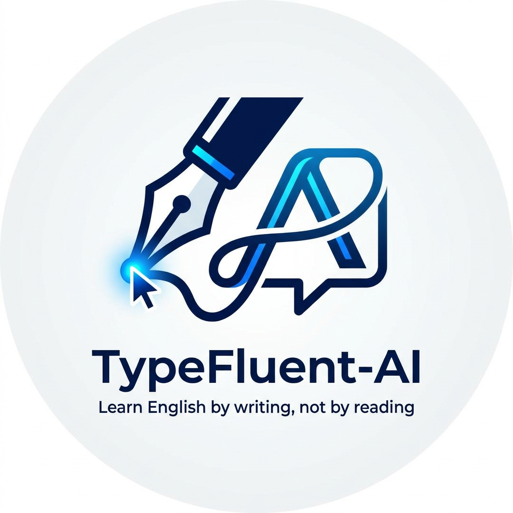

<p align="center">
  
</p>

<h1 align="center">TypeFluentAI</h1>

<p align="center">
  <strong>Learn English by Writing.</strong>
</p>

<p align="center">
  A Local AI-powered English Writing Coach
</p>

---

TypeFluentAI is an open-source Local AI project designed to help people improve their written English through active learning instead of passive correction.

Unlike traditional AI chatbots that simply rewrite your text, TypeFluentAI encourages you to think, write, understand your mistakes, rewrite your own answers and learn through deliberate practice.

Although the initial focus is on software engineers and IT professionals, the learning model is designed to be applicable to anyone who wants to become a more confident English writer.

---

## Why TypeFluentAI?

Most AI tools optimize productivity.

TypeFluentAI optimizes learning.

The objective is not to generate better English for the user.

The objective is to help the user write better English by themselves.

---

## Project Goals

- Build a complete Local AI application.
- Explore Harness Engineering through a real-world project.
- Design a modular Agent-Oriented Architecture.
- Create an AI that teaches instead of simply answering.
- Document the entire development journey publicly.

---

## Core Principles

- Local AI First
- Privacy by Design
- Active Learning
- Agent-Oriented Architecture
- Harness Engineering
- Open Source
- Build in Public

---

## Development Philosophy

This project follows one simple rule:

> Every important architectural decision must be documented before implementation.

The Harness is considered the source of truth for the entire project.

---

## Current Status

🚧 TypeFluentAI is currently in the Architecture & Design phase.

No production code has been written yet.

The current focus is on defining the learning philosophy, AI architecture and project foundations before implementation begins.

Every architectural decision, document and implementation will be publicly documented as the project evolves.

---

## Repository Structure

```text
.
├── .github/
├── .harness/
├── assets/
├── src/
├── README.md
├── LICENSE
├── package.json
└── .gitignore
```

---

## License

This project is licensed under the MIT License.
